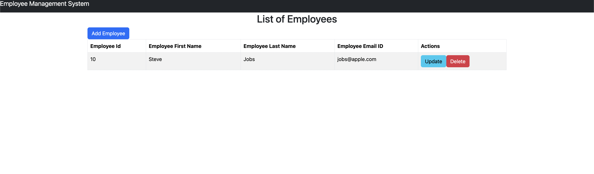
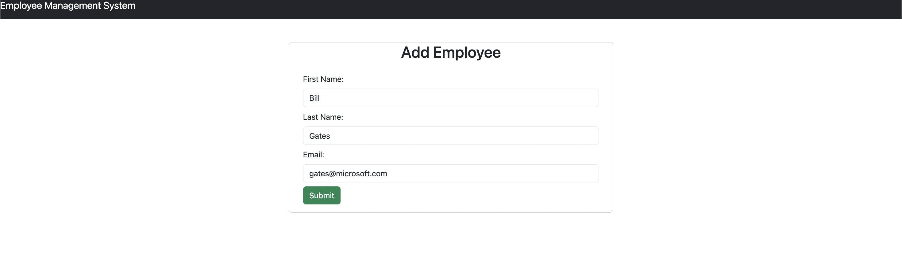
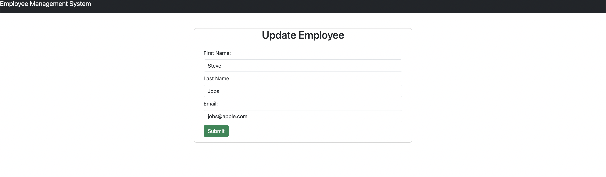

# Employee Management System Portal

This project is an Employee Management System Portal, a full-stack web application built using Java Spring Boot for the backend, MySQL as the database, and React + Vite for the frontend. The application allows users to manage employee records, including adding new employees, updating existing employee details, and deleting employees from the system.

## Project Overview:

The Employee Management System Portal provides the following features:
- Display a list of employees with their ID, first name, last name, and email.
- CRUD (Create, Read, Update, Delete) functionality for managing employee records.
- RESTful APIs for handling requests from the frontend.
- API testing conducted using Postman.

## Screenshots:







## Technologies Used:

- **Backend:** Java Spring Boot, MySQL
- **Frontend:** React, Vite

## Workflow Overview:

1. **Backend Development (Java Spring Boot):**
   - Implement RESTful APIs to handle CRUD operations for employee management.
   - Configure MySQL database to store employee records.
   - Set up endpoints to perform CRUD operations on employee data.

2. **Frontend Development (React + Vite):**
   - Develop a user interface using React for displaying employee records and forms for CRUD operations.
   - Utilize Vite for fast development and hot module reloading during frontend development.

3. **Integration and Testing:**
   - Integrate frontend and backend components to ensure seamless communication between the two.
   - Conduct API testing using Postman to verify the functionality and reliability of the RESTful APIs.

## Usage:

1. Clone the repository:

```
git clone https://github.com/iamutk4/Employee-Management-System.git
```
2. Start the backend server by running `EmsBackendApplication` in `ems-backend` folder
3. Start the frontend server:

```
cd ems-frontend
npm run dev
```